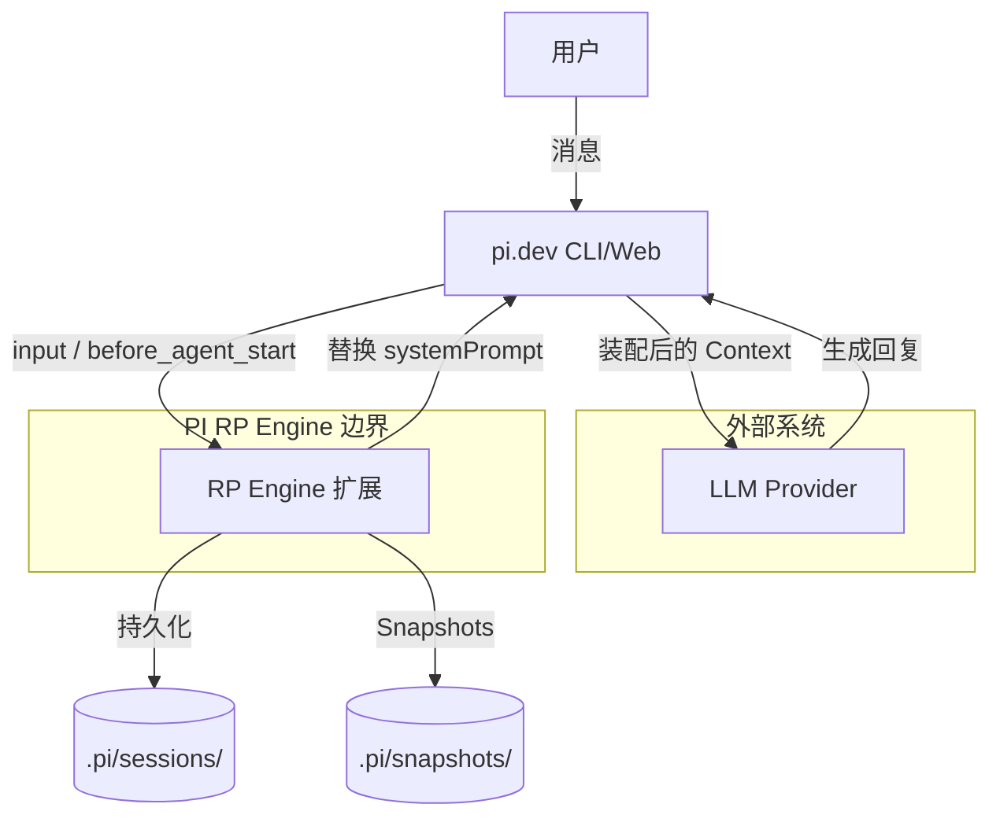
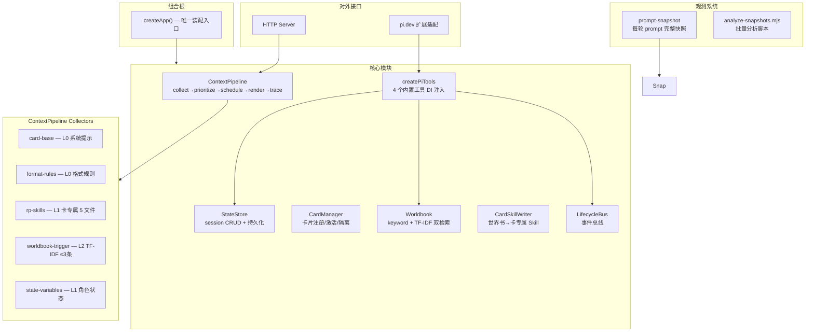

# PI RP Engine — 架构文档

LLM 无关的角色扮演运行时，专注上下文装配、状态管理、世界书→Skill 编译。

## 系统定位

引擎自身不调用 LLM。作为 pi.dev 扩展运行，在 LLM 调用之前装配最优上下文。同时支持独立 HTTP 模式。



## 内部架构



## 核心管线 (Context Pipeline)

5 阶段流水线，每个节点独立 try-catch + fallback：

```
1. Collect → 各 Collector 申报 PromptNode
2. Prioritize → 按 priority + attentionWeight 排序
3. Schedule → 双预算调度 (target / hard)
4. Render → 输出 prompt + display 两个版本
5. Trace → 记录全过程 → 同步 RuntimeStatus → logSnapshot
```

### Collector 注册表

| Collector | 层 | 优先级 | 降级策略 | 内容 |
|-----------|-----|--------|----------|------|
| card-base | L0-survival | 0 | drop | 系统提示词 |
| format-rules | L0-survival | 2 | summarize | 格式规则（来自 FORMAT_RULES.md） |
| rp-skills | L1-stable | 3-8 | summarize | 卡专属 5 个 skill 文件 |
| worldbook-trigger | L2-enhanced | 15 | truncate | TF-IDF/关键词 匹配触发条目 |
| state-variables | L1-stable | 90 | compress | 角色状态变量 |

### 双预算调度

- `target` (默认 24576 bytes) — 舒适区，超出触发降级
- `hard` (默认 40960 bytes) — 硬上限，绝对不超

4 种降级策略：drop（丢弃）、compress（压缩空行）、truncate（按比截断）、summarize（提取式摘要）

## 配置系统 (.rpconfig.json)

首次运行自动生成默认配置：

```json
{
  "token_budget": {
    "pipeline_target": 24576,
    "pipeline_hard": 40960,
    "output_reserve": 4000
  },
  "retriever": {
    "method": "tfidf",
    "top_k": 3,
    "max_tokens": 4000,
    "context_window": 3
  },
  "features": {
    "tfidf_retriever": true,
    "format_rules_collector": true,
    "state_collector": true
  }
}
```

所有新功能通过 Feature Flag 控制，关闭即回退旧行为。

## 世界书检索

双模式，通过 `retriever.method` 切换：

| 模式 | 算法 | 查询上下文 | 限制 |
|------|------|-----------|------|
| `keyword` | 关键词子串匹配 | 最近 1 条用户消息 | top_k 条 |
| `tfidf` | bigram TF-IDF 余弦相似度 | 最近 N 轮用户消息 | top_k + max_tokens 双限制 |

`searchBySimilarity()` 对无中文的查询自动 fallback 到关键词匹配。

## 卡专属 Skill 系统

```
卡 worldbook 条目
  → generateCardSkills()
    → Phase 1: 常开设定 → generateSkills() → 5 文件
    → Phase 2: 触发条目 → categorizeEntry() → 追加到对应文件
      → .pi/cards/{name}/skills/rp-engine/
          ├── 00-core-rules.md
          ├── style-protocol.md
          ├── judgment-system.md
          ├── variable-protocol.md
          └── world-context.md
        → SkillCollector 读取 → Pipeline 注入
```

首次激活生成，之后直接复用。`hasCardSkills()` 检查 `00-core-rules.md` 是否存在。

## PI 扩展事件流

```
session_start        → 懒初始化兜底 + RP Web 启动
before_agent_start   → ★ 核心：rpGuard + pipeline.assemble() + PI 指令
input                → 用户消息记录
message_end          → 格式纪律检查
turn_end             → Agent 管线 + 持久化 + logSnapshot
session_before_compact → 状态变量保护
session_shutdown     → 最终持久化
```

懒初始化策略：不依赖 `session_start`（PI 可能不触发），在 `before_agent_start` 首次调用时 init。

System Prompt 组装：
```
rpGuard（最高优先级角色扮演指令）
  + result.prompt（ContextPipeline 输出：世界观 + Skills + 格式 + 状态）
  + "---\n## PI 系统指令"
  + ev.systemPrompt（PI 原始系统指令，含工具声明）
```

## 一对一模型

一个 session = 一张卡片：

```
Session A ─── Card A ──┬── history (独立)
                        ├── variables (独立)
                        └── skills (独立)
Session B ─── Card B ──┬── history (独立)
                        ├── variables (独立)
                        └── skills (独立)
```

## 工具系统

4 个内置工具，通过 `createPiTools(sessionIdRef, stateStore, lifecycleBus)` DI 注入：

| 工具 | 功能 |
|------|------|
| `read_state` | 读取当前激活角色状态变量 |
| `update_state` | 更新角色状态变量 |
| `advance_time` | 推进游戏内时间 |
| `search_worldbook` | 关键词搜索世界书触发词条 |

每个工具调用包裹生命周期事件：`tool_call` → 执行 → `tool_result`。

## 观测系统

- **prompt-snapshot.ts** — 每轮 `before_agent_start` 后写入 `.pi/snapshots/{sid}/{ts}.json`，包含完整 PipelinePhase + collectorBytes 分解
- **analyze-snapshots.mjs** — 批量分析：token 分布、collector 占比、世界书命中率、降级统计

## 目录结构

```
src/
├── composition-root.ts        # DI 容器 — createApp() 唯一装配入口
├── types.ts                   # 核心类型 (SessionState 含 cardId)
├── state-store.ts             # session 状态存储 (StorageProvider 接口)
├── card-manager.ts            # 角色卡注册/激活/持久化
├── config.ts                  # .rpconfig.json 加载 + 默认配置合并
├── tools.ts                   # createPiTools() + HTTP 适配器
├── skill-generator.ts         # 世界书条目 → 5 个 skill 文件分类
├── server.ts                  # HTTP 独立服务入口
├── rp-web-server.ts           # RP WebSocket 服务器
│
├── context/
│   ├── pipeline.ts            # assemble() 主流程 + collectorBytes 报告
│   ├── scheduler.ts           # 双预算调度器
│   └── prompt-node.ts         # PromptNode 工厂
│
├── collectors/                # ★ 独立 Collector（NEW）
│   ├── format-rules.ts        # 格式规则 collector
│   └── state-variables.ts     # 角色状态 collector
│
├── lifecycle/
│   ├── events.ts              # LifecycleBus 事件总线
│   ├── agent-pipeline.ts      # Agent 中间件管线
│   └── skill-hooks.ts         # createSkillCollector() 工厂
│
├── worldbook/
│   └── index.ts               # keyword + TF-IDF 双检索
│
├── cards/
│   ├── types.ts               # CardState, CardMeta
│   ├── registry.ts            # CardRegistry JSON 持久化
│   ├── importer.ts            # SillyTavern PNG/JSON 导入
│   ├── skill-writer.ts        # 卡级 Skill 生成器
│   └── session-store.ts       # 卡级 Session 存储
│
├── commands/
│   └── index.ts               # 用户命令 (/card /status /reset 等)
│
├── observability/             # ★ 观测系统（NEW）
│   └── prompt-snapshot.ts     # 每轮 prompt 快照写入
│
├── infrastructure/
│   ├── storage-provider.ts    # StorageProvider 接口 + FileSystemStorage + MemoryStorage
│   ├── pi-jsonl-storage.ts    # ★ PiJsonlStorage — 项目级 JSONL 存储（StorageProvider 实现）
│   └── pi-jsonl-writer.ts     # JSONL 写入便捷函数（供路由实时追加消息）
│
├── presentation/http/
│   └── routes/                # session-routes, turn-routes, tool-routes
│
└── regex/
    └── hooks.ts               # prompt/display 双阶段正则钩子

.pi/                            # PI 扩展运行时
├── extensions/rp-engine/
│   └── index.ts               # PI 扩展入口 (lazy init + system prompt 替换)
├── cards/{name}/
│   ├── config.json
│   ├── state.json
│   ├── worldbook/             # 卡专属世界书
│   │   ├── [常开]设定/
│   │   └── [触发]关键词/
│   ├── skills/rp-engine/      # 卡专属 Skills（首次激活生成）
│   └── sessions/              # 卡级 sessions
├── snapshots/{sid}/           # 观测快照
└── sessions/                  # 项目级 session 存储 (JSONL 格式，id/parentId 树形结构)

scripts/
├── analyze-snapshots.mjs      # 快照批量分析工具
└── migrate-sessions.mjs       # 会话迁移 (全局目录 → 项目目录)
```

## 依赖注入模式

唯一装配入口 `createApp()`，所有服务构造函数注入：

```typescript
// ✅ 正确
const app = createApp()
app.stateStore.createSession(sid)

// ❌ 错误 — 模块单例（已全部标记 @deprecated）
import { stateStore } from "./state-store.js"
```
