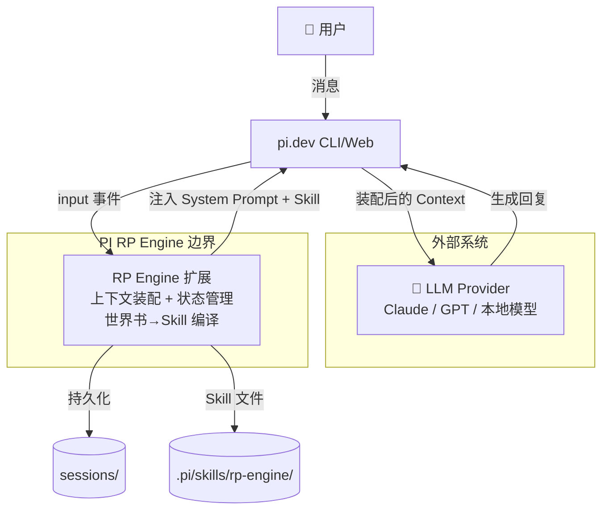
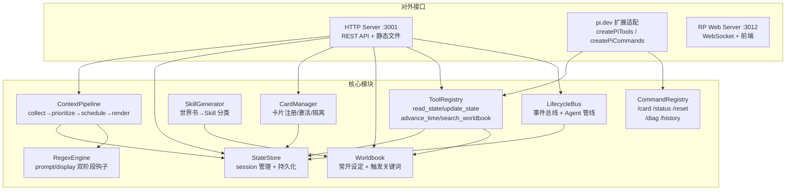
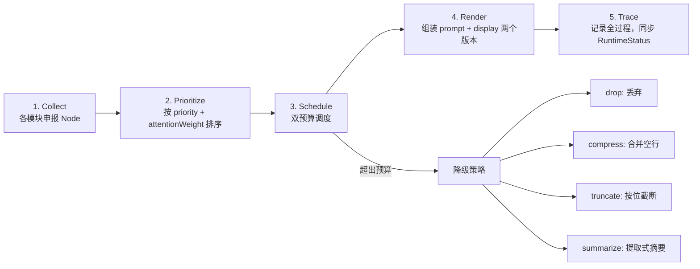
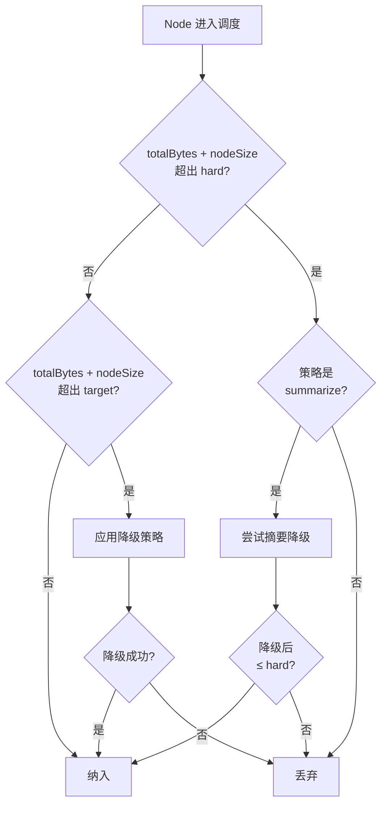
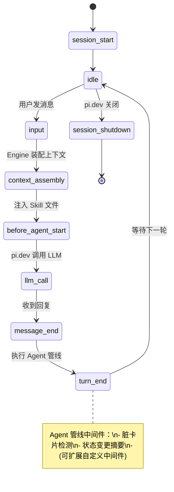
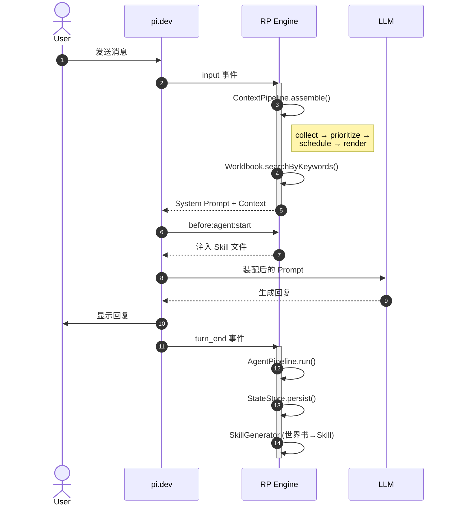
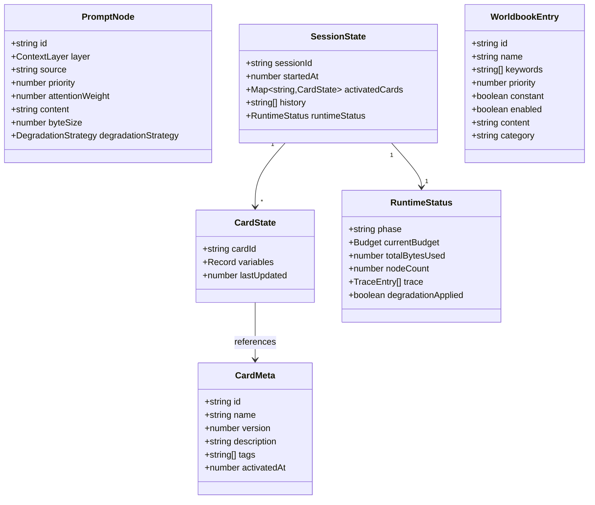
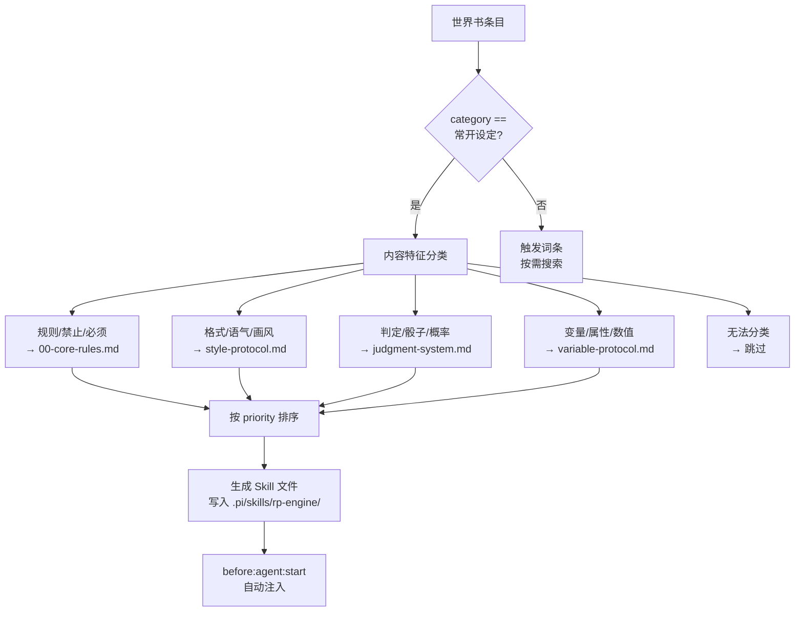

# PI RP Engine — 架构文档

LLM 无关的角色扮演运行时，专注上下文装配、状态管理、世界书→Skill 编译。

## 系统定位 (C4 Context)

引擎自身不调用 LLM，而是作为 pi.dev 扩展运行，在 LLM 调用之前准备最优上下文。



## 内部架构 (C4 Container)



## 核心管线 (Context Pipeline)

上下文装配是引擎的核心流程，5 阶段流水线：



### 双预算调度



预算模型：`target` = 舒适区（追求不触发降级），`hard` = 硬上限（绝对不能超过）。

## 生命周期事件



## 全链路时序



## 数据模型



## 世界书→Skill 编译



## 工具系统

| 工具 | 触发 | 功能 |
|------|------|------|
| `read_state` | LLM 自动 | 读取激活卡片的状态变量，keys 为空返回全部 |
| `update_state` | LLM 自动 | 更新卡片状态变量，类型校验 + 脏标记 |
| `advance_time` | LLM 自动 | 推进游戏内时间 |
| `search_worldbook` | LLM 自动 | 按关键词搜索触发词条 |

每个工具调用包裹在生命周期事件中：`tool_call` → 执行 → `tool_result`。

## 命令系统

| 命令 | 功能 |
|------|------|
| `/card list` | 列出所有已注册卡片及激活状态 |
| `/card activate <id>` | 激活指定卡片 |
| `/card deactivate <id>` | 停用指定卡片 |
| `/status` | 查看引擎状态 (phase/budget/nodes/degradation) |
| `/reset` | 清空当前 session 历史 |
| `/diag prompt` | 查看上下文装配 trace |
| `/history` | 查看对话历史 |

## 降级策略对比

| 策略 | 算法 | 适用场景 | 是否丢信息 |
|------|------|----------|------------|
| `drop` | 直接丢弃 | 不重要内容 | 全部丢失 |
| `compress` | 合并多余空行 | 格式化文本 | 仅去空白 |
| `truncate` | 按字节比截断 | 长文本 | 尾部丢失 |
| `summarize` | 提取式：前 N 句 + 末尾句 | 多句段文本 | 中间丢失 |

## 目录结构

```
src/
├── types.ts                  # 核心类型定义
├── index.ts                  # 统一导出
├── card-manager.ts           # 卡片管理（内存 + 文件持久化）
├── state-store.ts            # Session 状态存储
├── skill-generator.ts        # 世界书 → Skill 编译
├── tools.ts                  # AI 工具集（Pi + HTTP 双 API）
├── registry.ts               # Tool/Command 注册表基类
├── config.ts                 # .rpconfig.json 配置加载
├── utils.ts                  # 工具函数 (clamp/deepClone/setNested)
├── server.ts                 # HTTP 服务 (:3001)
├── rp-web-server.ts          # RP Web 服务 (:3012)
├── context/
│   ├── prompt-node.ts        # PromptNode 标准封装
│   ├── scheduler.ts          # 双预算调度器
│   └── pipeline.ts           # 上下文装配管线
├── lifecycle/
│   ├── events.ts             # 事件总线
│   ├── agent-pipeline.ts     # Agent 中间件管线
│   └── index.ts              # 生命周期导出
├── worldbook/
│   └── index.ts              # 世界书系统
├── cards/
│   ├── types.ts              # 卡片类型
│   ├── registry.ts           # 卡片注册表 (JSON)
│   └── importer.ts           # SillyTavern 兼容导入
├── commands/
│   └── index.ts              # 用户命令
└── regex/
    └── hooks.ts              # 双阶段正则引擎
```
